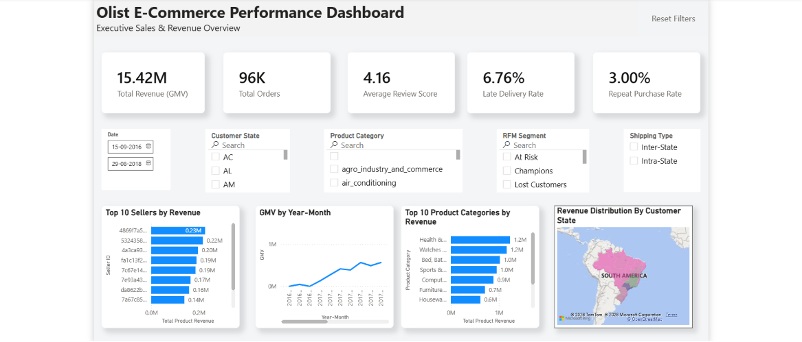
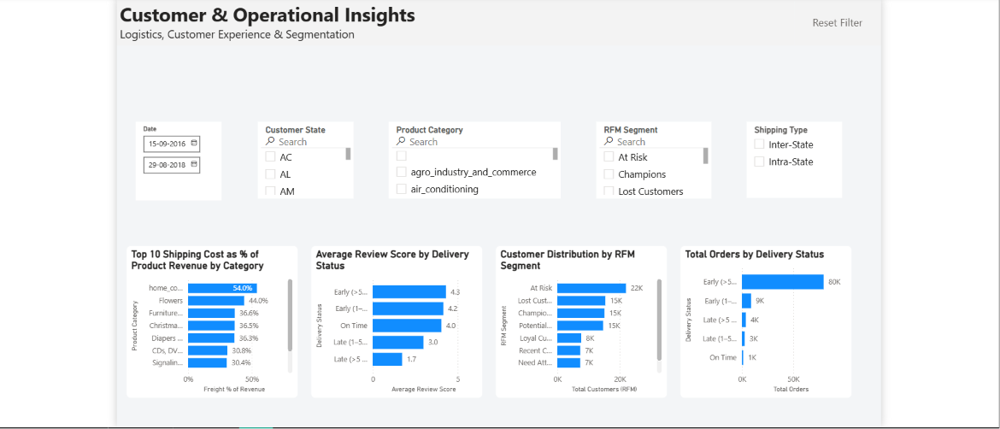

# Olist E-Commerce Analysis

A end-to-end data analyst portfolio project exploring 100,000+ orders from Brazil's largest e-commerce marketplace — from raw SQL foundations through Python EDA to an interactive Power BI dashboard.

---

## Business Problem

Olist connects small Brazilian merchants to major marketplaces under a single contract. With operations spanning all 27 Brazilian states, thousands of sellers, and dozens of product categories, the business generates rich transactional data across sales, logistics, customer behavior, and satisfaction.

This project answers four core business questions:
- Where is revenue coming from, and how has it trended over time?
- Who are Olist's customers, and how loyal are they?
- How reliable is Olist's delivery network, and where does it break down?
- What drives customer satisfaction — and what gets in the way of measuring it accurately?

---

## Dataset

**Source:** [Brazilian E-Commerce Public Dataset by Olist](https://www.kaggle.com/datasets/olistbr/brazilian-ecommerce) (Kaggle)
**Size:** 129.6 MB · 9 CSV files · ~100,000 orders · September 2016 – October 2018

| Table | Description |
|---|---|
| `olist_orders_dataset` | One row per order — status and timestamps |
| `olist_order_items_dataset` | One row per line item — product, seller, price, freight |
| `olist_customers_dataset` | One row per order-customer — location and unique ID |
| `olist_order_payments_dataset` | One or more rows per order — payment type and value |
| `olist_order_reviews_dataset` | One row per review — score and comment |
| `olist_products_dataset` | One row per product — category, dimensions, weight |
| `olist_sellers_dataset` | One row per seller — location |
| `olist_geolocation_dataset` | Many rows per zip prefix — lat/lng coordinates |
| `product_category_name_translation` | Portuguese → English category name mapping |

---

## Tech Stack

| Layer | Tools |
|---|---|
| Data storage | SQLite |
| SQL querying | Python (`sqlite3`) |
| EDA & cleaning | Python (`pandas`, `matplotlib`, `seaborn`) |
| Dashboard | Power BI |
| Version control | Git / GitHub |

---

## Project Structure

```
project-root/
├── data/                        # Raw Kaggle CSVs (gitignored)
├── olist_ecommerce.db           # SQLite database (gitignored)
├── sql/
│   ├── sales/                   # Revenue, orders, categories, sellers, payments
│   ├── customers/               # State distribution, repeat rate, RFM segmentation
│   ├── logistics/               # Late delivery rate, freight %, state-pair analysis
│   ├── reviews/                 # Score distribution, category/seller averages, correlation
│   └── finances/                # Payment type analysis
├── analysis/
│   ├── 01_data_cleaning.py      # Timestamp parsing, null handling, outlier flagging
│   ├── 02_eda.py                # Exploratory visualizations
│   ├── 03_delivery_outlier_investigation.py  # Placeholder timestamp & review anomaly audit
│   └── export_powerbi_data.py   # Exports cleaned CSVs for Power BI
├── exports/
│   ├── cleaned/                 # Intermediate cleaned DataFrames as CSVs (gitignored)
│   ├── investigation/           # Outlier audit exports (gitignored)
│   └── powerbi/                 # fact_orders_clean, dim_customers_rfm, agg_monthly_revenue (gitignored)
├── plots/                       # All EDA visualizations as PNGs
├── dashboard/
│   └── olist_dashboard.pbix     # Power BI report
├── helper/
│   └── utils.py                 # Shared utility functions
├── README.md
└── FINDINGS.md
```

---

## How to Reproduce

**Prerequisites:**
- Python 3.8+
- Power BI Desktop (free)

**Setup:**

1. Clone the repository:
   ```bash
   git clone https://github.com/RohanMishra47/olist-ecommerce-analytics.git
   cd olist-ecommerce-analytics
   ```

2. Install Python dependencies:
   ```bash
   pip install pandas matplotlib seaborn
   ```

3. Download the dataset from [Kaggle](https://www.kaggle.com/datasets/olistbr/brazilian-ecommerce) and place all 9 CSVs into the `/data` folder.

4. Run the setup script to create and populate the SQLite database:
   ```bash
   python day1_setup.py
   ```

5. Run the analysis scripts in order:
   ```bash
   python analysis/01_data_cleaning.py
   python analysis/02_eda.py
   python analysis/03_delivery_outlier_investigation.py
   python analysis/export_powerbi_data.py
   ```

6. Open `dashboard/olist_dashboard.pbix` in Power BI Desktop. If prompted, update the data source path to point to your local `/exports/powerbi/` folder.

---

## Key Insights

Full write-up in [`FINDINGS.md`](./FINDINGS.md). Headlines:

- **R$15.4M GMV** across 96,478 delivered orders — revenue grew ~9x from early 2017 to a stable plateau in 2018, with a clear Black Friday spike in November 2017
- **São Paulo dominates** at 41.92% of all orders, with the top 3 states (SP, RJ, MG) accounting for 66.51% of total volume
- **6.76% late delivery rate** overall — concentrated in northern and northeastern states far from the SP seller base
- **Review score is bimodal and noisy** — 57.78% five-star but one-star is the second most common score; a backend timestamp bug and mobile UI tap behavior both contaminate the delivery-satisfaction signal
- **High-revenue and high-volume categories diverge** — Watches & Gifts earns ~75% more per order than Bed, Bath & Table despite half the transaction volume

---

## Dashboard

The Power BI report (`dashboard/olist_dashboard.pbix`) contains two core pages:

| Page | Contents |
| --- | --- |
| Executive Sales & Revenue Overview | High-level KPI cards (GMV, Orders, Avg Review Score, Late Rate, Repeat Rate), monthly revenue trend, top sellers, top categories, and revenue geographic distribution |
| Customer & Operational Insights | Category freight-to-revenue ratio, average review score by delivery status, RFM customer segment breakdown, and total order volume by delivery status |

All visual layouts are controlled through **5 interactive slicers** positioned across the top header of each page:

* **Date Range:** `15-09-2016` to `29-08-2018`
* **Customer State:** Multi-select state filter (e.g., AC, AL, AM, SP)
* **Product Category:** Multi-select category filter (e.g., agro_industry_and_commerce, air_conditioning)
* **RFM Segment:** Customer loyalty segment filter (e.g., Champions, At Risk, Lost Customers)
* **Shipping Type:** Inter-State vs. Intra-State trade toggle

## Dashboard Preview



---

## Findings

See [`FINDINGS.md`](./FINDINGS.md) for the full analytical write-up, structured by theme — Sales, Customers, Logistics, and Satisfaction — with business questions, methods, results, and takeaways for each.
